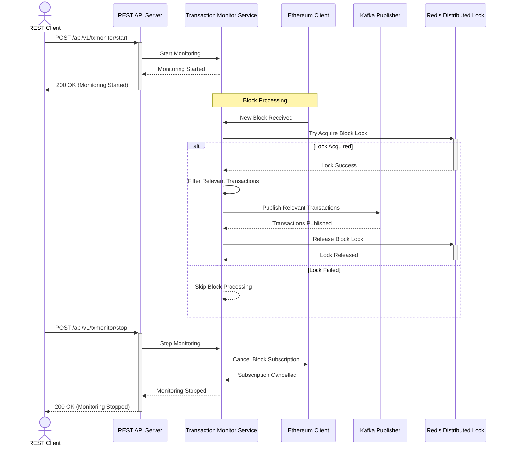
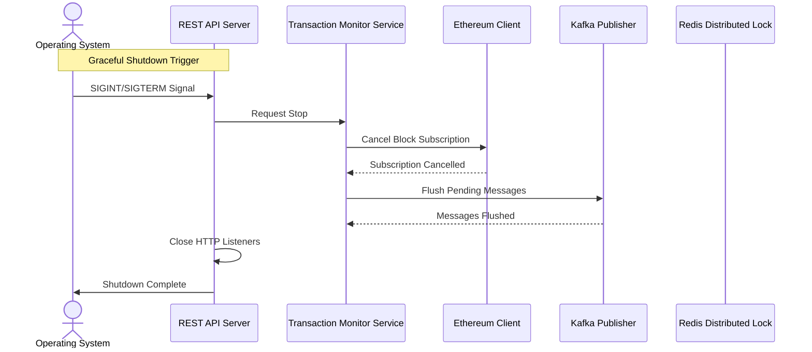

# Deblock Transaction Monitor - Architecture Overview

## System Architecture Sequence Diagrams

### 1. Transaction Monitoring Lifecycle

### 2. Graceful Server Shutdown

## Diagram Explanation

### Transaction Monitoring Lifecycle

1. **Start Monitoring**
   - Client sends a start request to the REST API
   - Transaction Monitor begins monitoring
   - API responds with success

2. **Block Processing**
   - Ethereum Client receives new blocks
   - For each block:
     * Transaction Monitor attempts to acquire a distributed lock
     * If lock is successful:
       - Filter relevant transactions
       - Publish transactions to Kafka
       - Release the lock
     * If lock fails, skip block processing

3. **Stop Monitoring**
   - Client sends a stop request to the REST API
   - Block subscription is cancelled
   - API responds with success

### Graceful Server Shutdown

1. Operating System sends shutdown signal
2. REST API Server initiates graceful shutdown
3. Transaction Monitor stops block subscription
4. Pending Kafka messages are flushed
5. HTTP listeners are closed
6. Server completes shutdown

## Architecture Components

### 1. Transaction Monitor Service
- Manages the lifecycle of blockchain transaction monitoring
- Coordinates between Ethereum Client, Kafka, and Redis
- Implements business logic for transaction filtering

### 2. Ethereum Client
- Handles blockchain block subscriptions
- Provides methods to fetch and stream blockchain data
- Manages connection to Ethereum nodes

### 3. Kafka Publisher
- Publishes filtered transactions as events
- Ensures at-least-once delivery semantics
- Provides a scalable message queue

### 4. Redis Distributed Lock
- Prevents multiple instances from processing the same block
- Ensures single-instance transaction monitoring
- Provides atomic locking mechanism

### 5. REST API
- Provides control endpoints for starting/stopping monitoring
- Handles client requests and manages service state
- Implements graceful shutdown mechanisms

## Key Design Principles

1. **Stateless Design**: Minimize internal state management
2. **Distributed Architecture**: Support horizontal scaling
3. **Fault Tolerance**: Implement retry and recovery mechanisms
4. **Event-Driven**: Use message queues for decoupled processing
5. **Observability**: Comprehensive logging and monitoring

## Deployment Considerations

- Containerized deployment using Docker
- Kubernetes-ready architecture
- Support for multiple environment configurations
- Configurable retry and backoff strategies

## Performance and Scalability

- Non-blocking I/O operations
- Efficient resource utilization
- Horizontal scaling through distributed design
- Configurable concurrency and worker pools

## Security Measures

- Secure configuration management
- Minimal permission principle
- Encrypted communication channels
- Rate limiting and circuit breaker patterns

## Conclusion

The Deblock Transaction Monitor is designed as a robust, scalable, and flexible system for real-time blockchain transaction tracking. Its modular architecture allows for easy extension and adaptation to various blockchain monitoring requirements.
